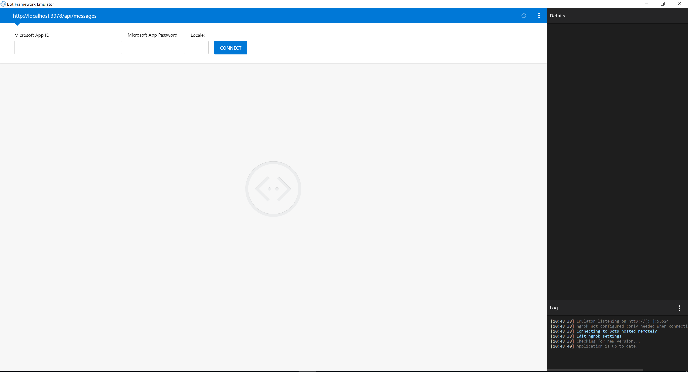

# Hackathon
## Requirements

The following requirements needs to be installed to get started.

* [Visual Studio Code](https://code.visualstudio.com/) or Visual Studio
* [NodeJS](https://nodejs.org/en/)
* [Bot Emulator](https://github.com/Microsoft/BotFramework-Emulator/releases)
* [ngrok](https://ngrok.com/)

# Getting your first bot up and running

## initialize the project
Create a new folder on your computer, open a console and navigate to that folder.

Quick Tip!
Press Alt, F, R while you are in the folder to open it in PowerShell.

Initiate a new nodejs project by running ```npm init```, follow the guide to get your project created.

Install the necessary dependencies required for building bots with Microsoft Bot Framework, this is done by running the following command in your open console.

```js
npm install express botbuilder --save
```

Next stop is to open your current project in VS Code, to quickly open it type ```code .``` in your console, this will open the current project directly in VS Code and you'll be ready to develop your bot!

## Developing your first dialog

Create a new file called ```index.js```and copy the following code into it, to get a "Echo bot" up and running.

```js
const express = require("express");
const builder = require("botbuilder");
const app = express();
const config = require("./config");

const connector = new builder.ChatConnector({
    appId: "",
    appPassword: ""
})
const bot = new builder.UniversalBot(connector);

bot.dialog("/", function (session) {
    session.send(`You said: ${session.message.text}`);
})

app.post("/api/messages", connector.listen());
app.listen(3978);
```

Press F5 to run the application.

Open the bot emulator and use the default setting and press connect.



Type Hello into the bot emulator and see that we have built a simple "Echo bot".

## Connecting to Live Assist

Login to Azure to create a Bot Channels Registration, this will give you an appId og appPassword.

Insert these credentials into your ```index.js```, this will enable the Azure Bot Service to connect to your bot.

Get ngrok up and running, by running the ngrok.exe and execute the command ```ngrok http 3978``` this will give you an external address.

This new address you need to add into the Bot Service in Azure, to enable the integration between Azure Bot Service and Live Assist. 